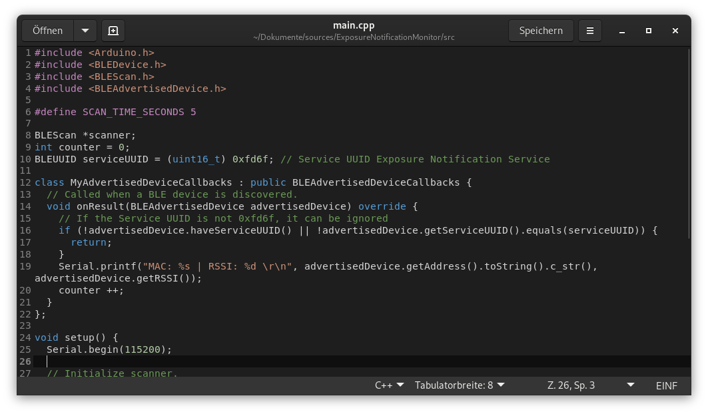

# VS Code dark Gedit Style
Ein von Visual Studio Code inspirierter Sytle für [Gedit](https://wiki.gnome.org/Apps/Gedit).

Gedit mit `C++` Code:

VS Code mit `C++` Code:

## Installieren
1. Datei herunterladen

`wget https://raw.githubusercontent.com/MrReSc/GeditTheme/main/vs_code_dark.xml`

2. Datei in Gedit Style Ordner kopieren

`mv vs_code_dark.xml $HOME/.local/share/gedit/styles/`

3. In den Einstellungen von Gedit den Style laden

