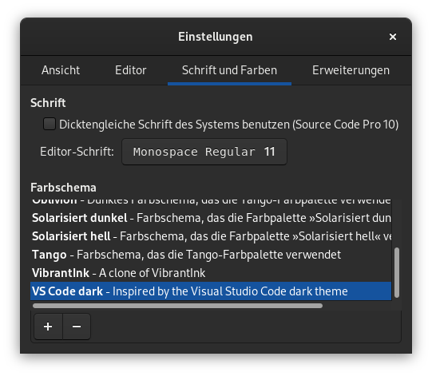

# Gedit Style erstellen

Der Standard Texteditor [Gedit](https://wiki.gnome.org/Apps/Gedit) der Desktopumgebung Gnome benutzt die Bibliothek [GtkSourceView](https://wiki.gnome.org/Projects/GtkSourceView/). Diese unterstützt unter anderem Syntaxhervorhebung und eine Möglichkeit das Aussehen (Style / Theme) anzupassen.
Da ich beruflich wie auch privat Visual Studio Code (VS Code, oder auch nur Code genannt) benutze und mir das dunkle Theme sehr gut gefällt, wollte ich das Aussehen von Gedit dementsprechend anpassen.

## Style generieren
Ich bin auf einen [Style-Generator](http://scribes.sourceforge.net/themegenerator.php) gestossen, bei der man sich ein Style mit seinen Farbvorstellungen generieren lassen kann.

Nach dem Herunterladen des Styles kann er in den Einstellungen von Gedit mit dem `+` Symbol geladen werden.

## Style anpassen
Wenn man wie ich, noch Feinheiten anpassen möchte, kann man das direkt in der `*.xml` Datei machen. Der geladene Style liegt im Pfad `~/.local/share/gedit/styles`. Nach dem Anpassen und speichern muss Gedit neu gestartet werden damit die Änderungen sichtbar werden. Das heisst, am besten einen anderen Editor benutzen um die `*.xml` Datei zu bearbeiten.

## Ergebnis
Da VS Code noch mehr als nur Syntaxhervorhebung macht, sieht es nicht identisch aus, aber für mich reicht es.

VS Code mit `C++` Code:

Gedit mit `C++` Code:

Falls man meinen Style auch installieren möchte, geht das am einfachsten so:

1. Datei herunterladen

`wget https://raw.githubusercontent.com/MrReSc/GeditTheme/main/vs_code_dark.xml`

2. Datei in Gedit Style Ordner kopieren

`mv vs_code_dark.xml $HOME/.local/share/gedit/styles/`

3. In den Einstellungen von Gedit den Style laden
